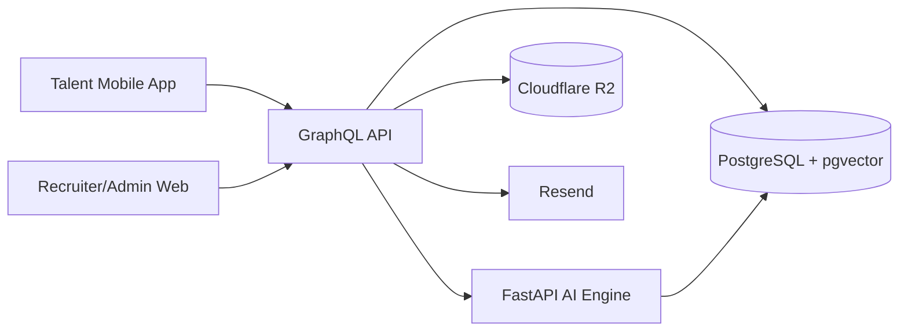

# AI Talent Marketplace Platform

AI-powered marketplace infrastructure for matching enterprise talent demand with global consultant supply.

The platform is built around one core loop:

```text
Talent registers -> AI parses resume -> Profile is generated
Recruiter posts role -> AI enhances role -> AI matches talent
Recruiter reviews shortlist -> interviews -> offers -> hire
Admin verifies talent and oversees platform health
```

## What is in the repo

```text
apps/
	web/       Next.js 14 recruiter dashboard + admin console
	mobile/    Expo Router talent application
	api/       Apollo GraphQL API
packages/
	shared/    shared Zod schemas, enums, and contracts
	db/        Prisma schema, migrations, seed data
	ui/        shared UI package
services/
	ai-engine/ FastAPI service for parsing, embeddings, matching, and role assist
```

## Stack

| Layer | Choice |
|------|--------|
| Monorepo | Turborepo + npm workspaces |
| Web | Next.js 14 App Router |
| Mobile | Expo SDK 50 + React Native + Expo Router |
| API | Node.js + Apollo Server |
| AI | Python + FastAPI |
| ORM | Prisma |
| Database | PostgreSQL 16 + pgvector |
| Auth | NextAuth.js on web + JWT for API/mobile |
| LLM provider | OpenRouter |
| Email | Resend |
| File storage | Cloudflare R2 |

## Architecture



Supporting documentation:

- [notes/FOUNDATION.md](notes/FOUNDATION.md)
- [notes/EXECUTION.md](notes/EXECUTION.md)
- [notes/ADR.md](notes/ADR.md)
- [notes/CASE-STUDY.md](notes/CASE-STUDY.md)
- [notes/DATABASE.md](notes/DATABASE.md)
- [notes/DEMO-SCRIPT.md](notes/DEMO-SCRIPT.md)
- [notes/DEPLOYMENT.md](notes/DEPLOYMENT.md)
- [notes/ROADMAP.md](notes/ROADMAP.md)

## Current status

- Sessions 1 through 17 are implemented.
- Session 18 is substantially complete locally: repo-wide typecheck passes, AI engine tests pass, and `npm run smoke:session18` validates health, CORS, RBAC, and local recruiter-admin-talent workflow coverage.
- Session 18 still needs hosted environment setup and live URL verification.
- Session 19 documentation and polish are complete locally.
- Current overall progress: 94%.

## Local setup

### Prerequisites

- Node.js 20+
- npm 10+
- Python 3.12+
- PostgreSQL 16 with pgvector, or Docker Desktop

### 1. Install dependencies

```bash
npm install
```

### 2. Configure environment variables

```bash
copy .env.example .env
```

Required values include:

- `DATABASE_URL`
- `DIRECT_URL`
- `JWT_SECRET`
- `JWT_REFRESH_SECRET`
- `OPENROUTER_API_KEY`
- `AI_ENGINE_URL`
- `NEXTAUTH_SECRET`
- `NEXTAUTH_URL`
- `NEXT_PUBLIC_GRAPHQL_API_URL`
- `EXPO_PUBLIC_GRAPHQL_API_URL`
- `CORS_ALLOWED_ORIGINS`

### 3. Start infrastructure

With Docker:

```bash
docker compose up -d postgres
```

Or point `.env` at an existing PostgreSQL 16 instance with pgvector enabled.

### 4. Apply schema and seed demo data

```bash
npm run db:generate
npm run db:migrate --workspace @atm/db
npm run db:seed --workspace @atm/db
```

If you only need already-created migrations applied to a database, use:

```bash
npx prisma migrate deploy --schema packages/db/prisma/schema.prisma
```

### 5. Run the platform

All core local services:

```bash
npm run dev
```

Or individually:

```bash
npm run dev:web
npm run dev:api
npm run dev:mobile
npm run dev:ai
```

## Validation commands

Repo-wide static validation:

```bash
npm run typecheck
```

AI engine tests:

```bash
npm run test --workspace @atm/ai-engine
```

Session 18 local integration smoke check:

```bash
npm run smoke:session18
```

To also exercise the local admin-backed approval and offer flow:

```bash
set SMOKE_LOCAL_ADMIN_BOOTSTRAP=true
npm run smoke:session18
```

Or provide real admin credentials in `.env`:

- `SMOKE_ADMIN_EMAIL`
- `SMOKE_ADMIN_PASSWORD`

## API and AI docs

- GraphQL endpoint: `http://localhost:4000/graphql`
- API health probe: `http://localhost:4000/healthz`
- AI engine OpenAPI: `http://localhost:8000/docs`
- AI engine health probe: `http://localhost:8000/health`

## Deployment path

- Web: Vercel using [vercel.json](vercel.json)
- API + AI engine + Postgres: Render using [render.yaml](render.yaml)
- Mobile preview and production builds: Expo EAS using [apps/mobile/eas.json](apps/mobile/eas.json)

Full deployment steps and environment mapping are in [notes/DEPLOYMENT.md](notes/DEPLOYMENT.md).

Hosted environment templates:

- [.env.production.web.example](.env.production.web.example)
- [.env.production.api.example](.env.production.api.example)
- [.env.production.ai.example](.env.production.ai.example)
- [.env.production.mobile.example](.env.production.mobile.example)
- [notes/ROLLOUT-CHECKLIST.md](notes/ROLLOUT-CHECKLIST.md)

These template files are expected to fail `npm run deploy:check` until their placeholder values are replaced with real hosted secrets and URLs.
Create private working copies such as `.env.production.web` and `.env.production.api`; those real deployment files are now ignored by git.

Before copying hosted values into Vercel, Render, or Expo, run the preflight validator:

```bash
npm run deploy:check -- all .env
```

After deployment, verify the live web, API, AI, GraphQL, and CORS wiring with:

```bash
npm run deploy:verify -- .env.production.api
```

## Demo story

The seeded demo data is intentionally shaped around a realistic marketplace flow:

- multiple recruiter companies across AI SaaS, healthtech, fintech, logistics, and enterprise operations
- talent profiles spanning AI, full-stack, data, cloud, QA, product design, and growth
- seeded demand templates aligned to the implemented recruiter and mobile workflows

## Deferred items

Explicitly kept out of MVP implementation:

- LinkedIn real API integration
- Stripe billing and payments
- SMS and OTP flows
- video interview platform integration
- e-signatures
- custom ML models
- advanced forecasting beyond current analytics simplification

These are tracked in [notes/ROADMAP.md](notes/ROADMAP.md).