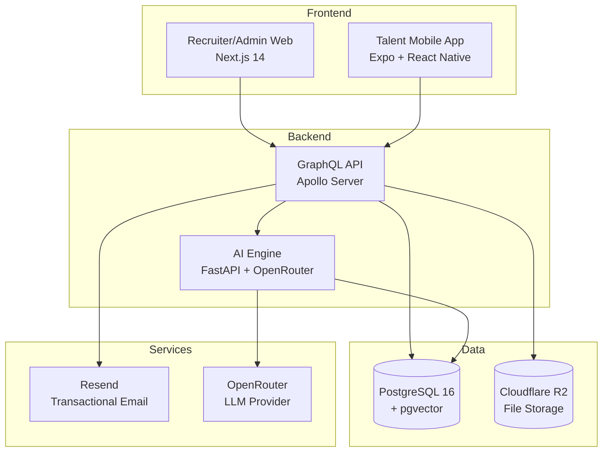

# AI Talent Marketplace Platform

> **Enterprise-grade talent intelligence platform** — AI-powered matching, recruiter dashboards, admin governance, and a talent mobile app. Built as a production-ready SaaS with real-time AI integration, pgvector semantic search, and a full hiring pipeline from role creation to contract onboarding.

---

## The Problem

Traditional ATS systems treat hiring as a list of applicants and a keyword filter. They fail at:
- **Intelligent matching** — no understanding of skill depth, career trajectory, or cultural fit
- **Demand-supply intelligence** — no forecasting, no supply gap visibility, no proactive talent surfacing
- **Unified lifecycle** — separate tools for sourcing, interviewing, offers, contracts, and analytics

## The Solution

This platform replaces fragmented hiring tooling with a **single AI-powered operating system** that covers the entire talent lifecycle:

```
Talent registers → AI parses resume → Profile auto-generated with extracted skills
Recruiter posts role → AI enhances job description → AI matches & ranks talent
Recruiter reviews shortlist → schedules interviews → extends offers → signs contracts
Admin verifies talent → governs demand pipeline → monitors platform analytics
```

**Every step is instrumented with AI.** The matching engine uses vector embeddings (pgvector) and a 7-factor scoring model. The role assistant generates full job descriptions from rough notes. Resume parsing extracts skills, experience, and certifications automatically.

---

## Platform Surfaces

| Surface | Technology | Purpose |
|---------|-----------|---------|
| **Recruiter Dashboard** | Next.js 14 (App Router) | Role management, AI matching, shortlists, interviews, offers, contracts, analytics |
| **Admin Console** | Same Next.js app (route group) | User management, talent verification, demand approvals, platform analytics, billing, concierge |
| **Talent Mobile App** | Expo SDK 50 + React Native | Registration, resume upload, profile management, match viewing, interview responses, offer acceptance |
| **GraphQL API** | Node.js + Apollo Server | 21 queries, 38 mutations — full business logic layer |
| **AI Engine** | Python + FastAPI | Resume parsing, skill extraction, embedding generation, semantic matching, role description generation |

---

## Architecture



---

## Key Features (16 SOW Modules Implemented)

### AI-Powered Core
- **AI Matching Engine** — 7-factor scoring: skill match (35%), experience fit (20%), availability (10%), pricing (10%), location (10%), cultural values (10%), past feedback (5%)
- **AI Role Description Assistant** — LLM generates structured JDs with responsibilities, requirements, salary bands, and skill recommendations from rough input
- **Resume Parsing & Skill Extraction** — Upload PDF → AI extracts skills, certifications, experience, generates profile
- **Semantic Talent Search** — pgvector embeddings enable "find me someone like this" searches beyond keyword matching
- **Demand Forecasting** — Trend analysis, supply gap prediction, market skill demand visualization

### Recruiter Workflow
- **Demand Management** — Full CRUD with status lifecycle: Draft → Active → Paused → Filled → Cancelled
- **AI Shortlisting** — One click generates a ranked shortlist with match scores per candidate
- **Interview Pipeline** — Schedule, track, rate, leave feedback — candidates respond from mobile
- **Offer Management** — Create, send, track offers through Draft → Sent → Accepted → Declined
- **Contract & Onboarding** — Track contracts through Offer Accepted → Contract Sent → Signed → Onboarding → Completed
- **Hiring Analytics** — Hiring velocity, pipeline conversion, cost-per-hire, skills demand charts

### Admin Governance
- **User Management** — RBAC with 4 roles: Talent, Recruiter, Admin, Headhunter
- **Talent Verification** — Review profiles, approve/reject with notes, verify skills and certifications
- **Demand Approvals** — Queue with approve/reject, hard-to-fill flagging, approval notes
- **Concierge (Headhunter)** — Assign headhunters to hard-to-fill roles, track external candidate submissions
- **Platform Analytics** — 9+ chart types: talent pool growth, skill distribution, supply/demand gaps, pricing trends, hiring timelines, utilization
- **Billing & Monetization** — 3 revenue models (subscription, hard-to-fill premium, 10% placement commission), pricing tiers, transaction history
- **Mobility Tracking** — Visa status, relocation pipeline, accommodation support

### Talent Experience (Mobile)
- **Smart Onboarding** — Upload resume → AI parses → review auto-generated profile → start receiving matches
- **Match Feed** — Scroll ranked matches with scores, tap for full 7-factor breakdown
- **Application Tracker** — Tabbed view: Interested → Shortlisted → Interview → Offer
- **Interview Management** — View scheduled interviews, accept/decline with reasons
- **Offer Response** — Review terms, accept/decline offers in-app
- **Notification Center** — Real-time alerts for new matches, interview requests, offer updates

---

## Tech Stack

| Layer | Choice | Why |
|-------|--------|-----|
| Monorepo | Turborepo + npm workspaces | Single repo, shared types, atomic deployments |
| Web | Next.js 14 (App Router) + shadcn/ui + Tailwind | Server components, dark theme, responsive |
| Mobile | Expo SDK 50 + React Native 0.73 + Expo Router | Cross-platform, file-based routing |
| API | Node.js + Apollo Server (GraphQL) | Type-safe queries, single endpoint |
| AI Engine | Python + FastAPI | OpenRouter LLM + pgvector embeddings |
| ORM | Prisma | Type-safe database access, migrations |
| Database | PostgreSQL 16 + pgvector | Vector similarity search for AI matching |
| Auth | NextAuth.js (web) + JWT (API/mobile) | Session management + stateless tokens |
| LLM | OpenRouter (OpenAI-compatible) | Flexible model routing, cost control |
| Embeddings | text-embedding-3-small (1536 dim) | Semantic search and matching |
| Email | Resend | Branded transactional emails (5 templates) |
| File Storage | Cloudflare R2 | S3-compatible, resume + document storage |
| Deployment | Vercel (web) + Render (API/AI/DB) | Scalable, auto-deploy from git |

---

## Repository Structure

```
├── apps/
│   ├── web/              # Next.js 14 — 27 routes (recruiter + admin)
│   ├── mobile/           # Expo — 12 screens (talent)
│   └── api/              # Apollo GraphQL — 59 operations
├── packages/
│   ├── shared/           # Shared types, Zod schemas, enums
│   ├── db/               # Prisma schema (18 models), migrations, seed
│   └── ui/               # Shared UI components
├── services/
│   └── ai-engine/        # FastAPI — 6 AI endpoints
├── notes/                # Architecture docs, design system, execution plan
├── docker-compose.yml    # Local development
├── docker-compose.prod.yml # Production deployment
├── render.yaml           # Render Blueprint (API + AI + DB)
└── vercel.json           # Vercel configuration (web)
```

---

## Data Model (18 Prisma Models)

```
User ──┬── TalentProfile ── TalentSkill ── Skill
       ├── Demand ── DemandSkill ── Skill
       ├── Company
       └── Notification

Demand ── Shortlist ── ShortlistCandidate ── Interview ── Offer

HeadhunterAssignment ── ExternalCandidateSubmission
PasswordResetToken
```

---

## Deployment

| Service | Platform | URL Pattern |
|---------|----------|-------------|
| Web (Recruiter + Admin) | Vercel | `https://ai-talent-marketplace-platform-web.vercel.app` |
| GraphQL API | Render | `https://atm-api-2hwg.onrender.com` |
| AI Engine | Render | `https://atm-ai-engine.onrender.com` |
| Database | Render | Managed PostgreSQL 16 + pgvector |

### Quick Start (Local)

```bash
# Install dependencies
npm install

# Configure environment
copy .env.example .env
# Fill in required values (see .env.example for guidance)

# Start database
docker compose up -d postgres

# Apply schema and seed demo data
npm run db:generate
npm run db:migrate --workspace @atm/db
npm run db:seed --workspace @atm/db

# Run all services
npm run dev
```

### Production (Docker)

```bash
npm run deploy:prepare
# Edit .env.production.web, .env.production.api, .env.production.ai
POSTGRES_PASSWORD=your-secure-password docker compose -f docker-compose.prod.yml up --build -d
```

### Validation

```bash
npm run typecheck           # Full repo TypeScript check
npm run smoke:session18     # Integration smoke tests
npm run deploy:check        # Pre-deployment env validation
```

---

## API Endpoints

| Endpoint | Purpose |
|----------|---------|
| `POST /graphql` | GraphQL API (21 queries + 38 mutations) |
| `GET /healthz` | API health probe |
| `POST /ai/parse-resume` | Resume parsing + skill extraction |
| `POST /ai/generate-embedding` | Vector embedding generation |
| `POST /ai/match-talent` | AI talent matching (7-factor scoring) |
| `POST /ai/generate-role` | AI role description generation |
| `GET /health` | AI engine health probe |
| `GET /docs` | AI engine OpenAPI documentation |

---

## Demo Credentials

| Role | Email | Password |
|------|-------|----------|
| Recruiter | `recruiter@marketplace.example` | `Password1!` |
| Admin | `admin@marketplace.example` | `Password1!` |
| Headhunter | `headhunter@marketplace.example` | `Password1!` |
| Talent | `amina.khaled.talent@example.com` | `Password1!` |

---

## Quality & Security

- **TypeScript everywhere** — zero `any` types, strict mode
- **RBAC** — route-level and resolver-level role checks (Talent, Recruiter, Admin, Headhunter)
- **JWT authentication** — access + refresh token rotation, bcrypt password hashing
- **Input validation** — Zod schemas shared between frontend and API
- **Secure secrets** — all API keys in environment variables, startup validation
- **File security** — MIME type allowlist + 5MB file size cap on uploads
- **AI engine auth** — internal API key required for all AI endpoints
- **CORS** — allowlist-based cross-origin configuration

---

## Documentation

| Document | Purpose |
|----------|---------|
| [notes/FOUNDATION.md](notes/FOUNDATION.md) | Architecture decisions, data model, tech stack rationale |
| [notes/EXECUTION.md](notes/EXECUTION.md) | 19-session build plan mapping every SOW objective |
| [notes/ADR.md](notes/ADR.md) | Architecture Decision Records |
| [notes/DATABASE.md](notes/DATABASE.md) | ERD, model relationships, migration guide |
| [notes/DESIGN-SYSTEM.md](notes/DESIGN-SYSTEM.md) | Color tokens, component patterns, typography |
| [notes/DEPLOYMENT.md](notes/DEPLOYMENT.md) | Deployment topology and environment setup |
| [notes/DEMO-SCRIPT.md](notes/DEMO-SCRIPT.md) | End-to-end demo walkthrough script |
| [notes/CASE-STUDY.md](notes/CASE-STUDY.md) | Problem statement, solution, outcomes |
| [notes/ROADMAP.md](notes/ROADMAP.md) | Phase 2/3 expansion roadmap |
| [notes/ROLLOUT-CHECKLIST.md](notes/ROLLOUT-CHECKLIST.md) | Production launch checklist |
| [PROGRESS.md](PROGRESS.md) | Live progress tracker (99% complete) |

---

## Phase 2 Roadmap (Post-MVP)

Deliberately deferred from MVP — tracked in [notes/ROADMAP.md](notes/ROADMAP.md):

- LinkedIn OAuth (real API integration)
- Stripe billing & payment processing
- SMS/OTP authentication (Twilio)
- Video interview integration (Zoom/Teams API)
- E-signature integration (DocuSign)
- Custom ML models (beyond LLM-based matching)
- Advanced demand forecasting engine
- Native App Store builds (iOS/Android via EAS)
- Multi-language / i18n support

---

## Project Stats

| Metric | Count |
|--------|-------|
| SOW Modules Implemented | 16/16 |
| SOW Deliverables Complete | 7/7 |
| Web Routes | 27 |
| Mobile Screens | 12 |
| GraphQL Operations | 59 (21 queries + 38 mutations) |
| Prisma Models | 18 |
| AI Endpoints | 6 |
| Email Templates | 5 |
| Build Sessions | 19 |

---

*Built with TypeScript, Next.js 14, React Native, Apollo GraphQL, FastAPI, PostgreSQL + pgvector, and OpenRouter AI.*