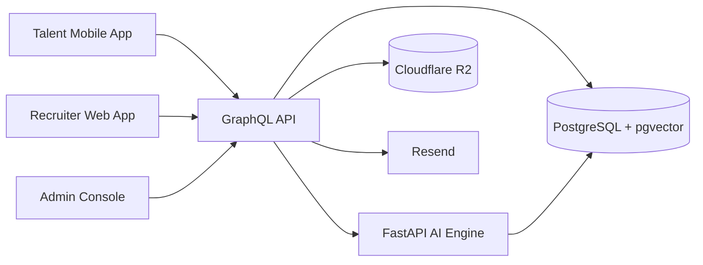

# Project Map

This project includes the traditional full-stack layers:

- Frontend: web app for recruiters and admins
- Frontend: mobile app for talent
- Backend: GraphQL API for business workflows
- AI backend: FastAPI service for parsing, embeddings, matching, and role generation
- Database: PostgreSQL 16 with Prisma and pgvector
- Deployment: Vercel for web, Render for API and AI, Expo EAS for mobile
- DevOps: Turborepo monorepo, Docker Compose for local infra, deployment validation scripts, smoke tests, typechecks, and environment templates

In short: this is a real multi-app product, not just a frontend or just an API.

## 1. Big Picture

The platform connects three actors:

- Talent uses the mobile app to register, upload a resume, build a profile, review matches, and respond to interviews and offers.
- Recruiters use the web app to create roles, search talent, review shortlists, and move candidates through hiring.
- Admins use the web admin console to verify talent, approve roles, manage companies, and monitor platform health.

The AI engine supports both sides by turning resumes and role descriptions into structured data, embeddings, and ranked matches.

## 2. Architecture At A Glance



## 3. Main Layers

### Frontend

There are two real frontend surfaces.

#### Web frontend

- Path: `apps/web`
- Stack: Next.js 14 App Router
- Users: recruiters and admins
- What it does:
  - authentication
  - recruiter dashboard
  - role posting and AI role assist
  - smart talent search
  - shortlist review
  - interviews and offers
  - recruiter analytics
  - admin verification, approvals, companies, concierge, users, analytics

#### Mobile frontend

- Path: `apps/mobile`
- Stack: Expo + React Native + Expo Router
- Users: talent / consultants
- What it does:
  - register and sign in
  - upload resume
  - review AI-built profile
  - upload identity and certification documents
  - see matches
  - track applications, interviews, offers, notifications
  - update profile and availability

### Backend

#### Main application backend

- Path: `apps/api`
- Stack: Node.js + Apollo Server + GraphQL
- Role: central business layer for the whole product

This is the system that both frontend apps talk to. It handles:

- auth and RBAC
- talent profiles
- demands / roles
- shortlists
- interviews
- offers
- admin workflows
- notifications
- analytics queries
- file upload orchestration
- AI engine calls

#### AI backend

- Path: `services/ai-engine`
- Stack: Python + FastAPI
- Role: specialized intelligence layer

This service handles:

- resume parsing
- skill extraction
- embedding generation
- semantic search support
- candidate matching and scoring
- AI role description generation

### Database

- Path: `packages/db`
- Stack: Prisma + PostgreSQL 16 + pgvector

This stores the core marketplace records:

- users
- talent profiles
- skills
- demands
- shortlists
- interviews
- offers
- companies
- notifications
- analytics source data
- vector embeddings for semantic matching

### Shared packages

- `packages/shared`: shared schemas, enums, validation contracts
- `packages/ui`: shared UI package for web surfaces

These keep the system consistent across apps.

## 4. Repo Layout

```text
apps/
  web/       recruiter web app + admin console
  mobile/    talent mobile app
  api/       GraphQL API
packages/
  shared/    shared contracts and validation
  ui/        shared web UI components
  db/        Prisma schema, migrations, seed
services/
  ai-engine/ FastAPI AI service
scripts/     validation, smoke, deployment helpers
notes/       architecture, database, deployment, roadmap, demo docs
```

## 5. Core Product Flow

This is the main loop the whole system is built around:

```text
Talent registers
-> uploads resume
-> AI parses resume into profile data
-> talent completes profile and verification

Recruiter creates a role
-> AI improves the role description
-> AI matches ranked talent
-> recruiter reviews shortlist
-> recruiter schedules interview
-> recruiter sends offer

Admin verifies talent and approves platform workflows
```

If you understand this loop, you understand the project.

## 6. Where Each Concern Lives

### Traditional frontend

Yes. The project has traditional user-facing UI layers:

- browser UI for recruiter and admin
- phone UI for talent

### Traditional backend

Yes. The project has a central backend:

- GraphQL API as the application backend
- FastAPI AI service as a supporting specialized backend

### Database

Yes. The project has a real database layer:

- PostgreSQL for business data
- pgvector for similarity search and AI matching
- Prisma schema and migrations for structure changes

### Deployment

Yes. The project has real deployment planning and scaffolding:

- Vercel for web
- Render for API and AI engine
- Expo EAS for mobile builds
- env templates and deployment guides
- deploy preflight and post-deploy verification scripts

### DevOps

Yes. This is not enterprise-heavy DevOps, but it does include real delivery tooling:

- Turborepo monorepo management
- workspace scripts for build, dev, typecheck, db, smoke tests
- Docker Compose for local database infrastructure
- deployment validation scripts
- hosted env templates
- rollout checklist
- smoke verification and health probes

## 7. External Services

The project also depends on a few supporting services:

- OpenRouter for LLM and embedding-compatible calls
- Cloudflare R2 for file storage
- Resend for email
- NextAuth for web auth handling

## 8. What Is Tangible Right Now

What already exists in concrete form:

- a real web UI
- a real admin console
- a real mobile app codebase
- a real GraphQL API
- a real AI service
- a real database schema and migrations
- real docs for deployment, architecture, and demo walkthroughs

What is still not fully closed out:

- hosted production environment setup
- live deployed URL verification
- final mobile build verification against deployed APIs

## 9. Current Maturity

- Sessions 1 to 17 are implemented
- Session 18 is largely complete locally and includes integration testing and deployment scaffolding
- Session 19 documentation and polish are complete locally
- Overall tracked progress: 94%

## 10. Fast Mental Model

Use this shortcut:

- `apps/web` = recruiter + admin frontend
- `apps/mobile` = talent frontend
- `apps/api` = main business backend
- `services/ai-engine` = intelligence backend
- `packages/db` = database schema
- `scripts` = validation and deployment helpers
- `notes` = human-readable architecture and rollout docs

If you want to understand the project quickly, start in this order:

1. `README.md`
2. `map.md`
3. `notes/FOUNDATION.md`
4. `notes/DEPLOYMENT.md`
5. `packages/db/prisma/schema.prisma`
