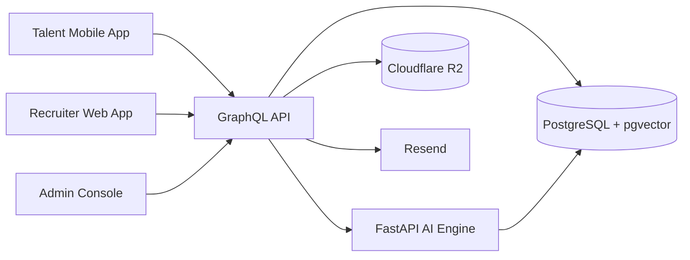

# Project Map

This project includes the traditional full-stack layers:

- Frontend: web app for recruiters and admins
- Frontend: mobile app for talent
- Backend: GraphQL API for business workflows
- AI backend: FastAPI service for parsing, embeddings, matching, and role generation
- Database: PostgreSQL 16 with Prisma and pgvector
- Deployment: Vercel for web, Render for API and AI, Expo EAS for mobile
- DevOps: Turborepo monorepo, Docker Compose for local infra, deployment validation scripts, smoke tests, typechecks, and environment templates

In short: this is a real multi-app product, not just a frontend or just an API.

## 1. Big Picture

The platform connects three actors:

- Talent uses the mobile app to register, upload a resume, build a profile, review matches, and respond to interviews and offers.
- Recruiters use the web app to create roles, search talent, review shortlists, and move candidates through hiring.
- Admins use the web admin console to verify talent, approve roles, manage companies, and monitor platform health.

The AI engine supports both sides by turning resumes and role descriptions into structured data, embeddings, and ranked matches.

## 2. Architecture At A Glance



## 3. Main Layers

### Frontend

There are two real frontend surfaces.

#### Web frontend

- Path: `apps/web`
- Stack: Next.js 14 App Router
- Users: recruiters and admins
- What it does:
  - authentication
  - recruiter dashboard
  - role posting and AI role assist
  - smart talent search
  - shortlist review
  - interviews and offers
  - recruiter analytics
  - admin verification, approvals, companies, concierge, users, analytics

#### Mobile frontend

- Path: `apps/mobile`
- Stack: Expo + React Native + Expo Router
- Users: talent / consultants
- What it does:
  - register and sign in
  - upload resume
  - review AI-built profile
  - upload identity and certification documents
  - see matches
  - track applications, interviews, offers, notifications
  - update profile and availability

### Backend

#### Main application backend

- Path: `apps/api`
- Stack: Node.js + Apollo Server + GraphQL
- Role: central business layer for the whole product

This is the system that both frontend apps talk to. It handles:

- auth and RBAC
- talent profiles
- demands / roles
- shortlists
- interviews
- offers
- admin workflows
- notifications
- analytics queries
- file upload orchestration
- AI engine calls

#### AI backend

- Path: `services/ai-engine`
- Stack: Python + FastAPI
- Role: specialized intelligence layer

This service handles:

- resume parsing
- skill extraction
- embedding generation
- semantic search support
- candidate matching and scoring
- AI role description generation

### Database

- Path: `packages/db`
- Stack: Prisma + PostgreSQL 16 + pgvector

This stores the core marketplace records:

- users
- talent profiles
- skills
- demands
- shortlists
- interviews
- offers
- companies
- notifications
- analytics source data
- vector embeddings for semantic matching

### Shared packages

- `packages/shared`: shared schemas, enums, validation contracts
- `packages/ui`: shared UI package for web surfaces

These keep the system consistent across apps.

## 4. Repo Layout

```text
apps/
  web/       recruiter web app + admin console
  mobile/    talent mobile app
  api/       GraphQL API
packages/
  shared/    shared contracts and validation
  ui/        shared web UI components
  db/        Prisma schema, migrations, seed
services/
  ai-engine/ FastAPI AI service
scripts/     validation, smoke, deployment helpers
notes/       architecture, database, deployment, roadmap, demo docs
```

## 5. Core Product Flow

This is the main loop the whole system is built around:

```text
Talent registers
-> uploads resume
-> AI parses resume into profile data
-> talent completes profile and verification

Recruiter creates a role
-> AI improves the role description
-> AI matches ranked talent
-> recruiter reviews shortlist
-> recruiter schedules interview
-> recruiter sends offer

Admin verifies talent and approves platform workflows
```

If you understand this loop, you understand the project.

## 6. Where Each Concern Lives

### Traditional frontend

Yes. The project has traditional user-facing UI layers:

- browser UI for recruiter and admin
- phone UI for talent

### Traditional backend

Yes. The project has a central backend:

- GraphQL API as the application backend
- FastAPI AI service as a supporting specialized backend

### Database

Yes. The project has a real database layer:

- PostgreSQL for business data
- pgvector for similarity search and AI matching
- Prisma schema and migrations for structure changes

### Deployment

Yes. The project has real deployment planning and scaffolding:

- Vercel for web
- Render for API and AI engine
- Expo EAS for mobile builds
- env templates and deployment guides
- deploy preflight and post-deploy verification scripts

### DevOps

Yes. This is not enterprise-heavy DevOps, but it does include real delivery tooling:

- Turborepo monorepo management
- workspace scripts for build, dev, typecheck, db, smoke tests
- Docker Compose for local database infrastructure
- deployment validation scripts
- hosted env templates
- rollout checklist
- smoke verification and health probes

## 7. External Services

The project also depends on a few supporting services:

- OpenRouter for LLM and embedding-compatible calls
- Cloudflare R2 for file storage
- Resend for email
- NextAuth for web auth handling

## 8. What Is Tangible Right Now

What already exists in concrete form:

- a real web UI
- a real admin console
- a real mobile app codebase
- a real GraphQL API
- a real AI service
- a real database schema and migrations
- real docs for deployment, architecture, and demo walkthroughs

What is still not fully closed out:

- hosted production environment setup
- live deployed URL verification
- final mobile build verification against deployed APIs

## 9. Current Maturity

- Sessions 1 to 17 are implemented
- Session 18 is largely complete locally and includes integration testing and deployment scaffolding
- Session 19 documentation and polish are complete locally
- Overall tracked progress: 94%

## 10. Fast Mental Model

Use this shortcut:

- `apps/web` = recruiter + admin frontend
- `apps/mobile` = talent frontend
- `apps/api` = main business backend
- `services/ai-engine` = intelligence backend
- `packages/db` = database schema
- `scripts` = validation and deployment helpers
- `notes` = human-readable architecture and rollout docs

If you want to understand the project quickly, start in this order:

1. `README.md`
2. `map.md`
3. `notes/FOUNDATION.md`
4. `notes/DEPLOYMENT.md`
5. `packages/db/prisma/schema.prisma`

---

## 11. SOW Audit — Completion Scores

> Full audit of every SOW module against actual implemented code.
> Date: March 2026. Scores are 0–100%.
> Legend: ✅ built · ⚠️ partial · ❌ not built / deferred

---

### Overall Score: **74 / 100**

| SOW Module | Score |
|---|---|
| 3.1 Talent Registration & Profile System | 75% |
| 3.2 AI Talent Matching Engine | 85% |
| 3.3 Demand Management System | 95% |
| 3.4 AI Role Description Assistant | 95% |
| 3.5 Talent Shortlisting System | 95% |
| 3.6 Smart Talent Search | 90% |
| 3.7 Concierge Talent Acquisition | 70% |
| 3.8 Interview & Hiring Workflow | 85% |
| 3.9 Talent Mobility Services | 0% |
| 3.10 Talent Demand Forecasting Engine | 60% |
| 3.11 Talent Supply Management | 65% |
| 3.12 Governance & Oversight Dashboard | 90% |
| 3.13 Reporting & Analytics | 90% |
| 3.14 Pricing & Monetization System | 25% |
| 3.15 Notification System | 85% |
| 3.16 Contracting & Onboarding System | 50% |
| §4 Admin Platform | 80% |
| §5 Integrations | 15% |
| §6 AI Capabilities | 85% |
| §7 Security & Compliance | 60% |
| §9 Expected Deliverables | 80% |

---

### §3.1 Talent Registration & Profile System — **75%**

**What the SOW requires:**

- Email / Phone / SSO signup
- LinkedIn OAuth integration
- Resume upload
- Profile verification
- LinkedIn profile parsing (automated)
- Resume parsing with AI extraction
- Skill identification, experience classification, industry tagging
- Full profile data: personal, skills, certifications, career trajectory, availability, pricing, location, visa, portfolio, identity verification

**What is built:**

| Feature | Status | Detail |
|---|---|---|
| Email signup + login | ✅ | `register` + `login` mutations, bcrypt passwords, JWT tokens |
| Phone / OTP signup | ❌ | Phase 2 — Twilio not integrated |
| LinkedIn OAuth | ⚠️ | Schema and `linkedInAuthProvider` query exist but OAuth is intentionally stubbed — returns `enabled: false` |
| Resume upload (PDF) | ✅ | `uploadAsset(assetType: RESUME)` → Cloudflare R2 (or local dev fallback) |
| Profile verification workflow | ✅ | Admin can verify/reject talent via `verifyTalent` / `rejectTalent` mutations; `verificationStatus` field on profile |
| E-mail verification flag | ⚠️ | `emailVerified` field exists on User — no email verification flow implemented, field defaults to `false` |
| AI resume parsing (PDF → structured) | ✅ | FastAPI `/parse-resume` — PyPDF text extraction + OpenRouter LLM + heuristic fallback |
| Skill identification | ✅ | Extracted from resume and stored as `TalentSkill` entries |
| Experience classification | ✅ | Parsed into `Experience` model entries (title, company, dates, description) |
| Industry tagging | ✅ | `industries` string array on `TalentProfile` |
| LinkedIn profile parsing | ❌ | Not real — LinkedIn API requires a production app approval; stubbed |
| All SOW profile fields | ✅ | `TalentProfile` schema has all fields: certifications, education, career trajectory, availability, hourlyRate, location preferences, work visa, portfolio URLs, identity doc URLs |
| Rapid profile generation via LinkedIn | ❌ | Not built |

**Gap:** Phone auth and LinkedIn OAuth are the two deferred items. Both documented as Phase 2.

---

### §3.2 AI Talent Matching Engine — **85%**

**What the SOW requires:**

- NLP-based skill extraction
- Embedding similarity search
- Candidate scoring models
- AI ranking system
- Match score, top candidate shortlist, availability alerts, pricing estimates
- Continuous improvement from interaction data

**What is built:**

| Feature | Status | Detail |
|---|---|---|
| NLP skill extraction | ✅ | `app/parsing/` — LLM-powered extraction with heuristic fallback |
| Embedding generation | ✅ | `app/matching/embedding.py` — OpenRouter `text-embedding-3-small` (1536-dim) with deterministic hash fallback |
| pgvector similarity search | ✅ | `vector(1536)` columns on `TalentProfile.profileEmbedding` and `Demand.demandEmbedding`; cosine search in `search_profiles_by_embedding()` |
| 7-factor scoring model | ✅ | `scoring.py` — skill match 35%, experience 20%, availability 10%, pricing 10%, location 10%, cultural fit 10%, feedback 5% |
| AI ranking and shortlist | ✅ | `generateShortlist` mutation → calls AI engine `POST /match-candidates` → returns ranked shortlists with `matchScore` + `scoreBreakdown` JSON + `aiExplanation` |
| Availability alerts | ⚠️ | Notifications exist for match events but no proactive "talent is now available" background alerts |
| Pricing estimates | ✅ | `budgetMin/Max` on demand vs `hourlyRateMin/Max` on profile used in scoring |
| Talent demand alerts | ⚠️ | Notification created on shortlist generation; no push-based demand alert feed |
| Self-improving from interactions | ❌ | No feedback loop that updates the ML model from click/hire signals |

**Gap:** The system is a compute-on-demand matcher rather than a continuously learning model. Interaction data is partially captured (via `AnalyticsEvent` and `PlacementFeedback` models) but not fed back into the scoring.

---

### §3.3 Demand Management System — **95%**

**What the SOW requires:**

- Demand creation with all fields: required skills, role description, experience level, location, start date, contract duration, pricing range, project requirements
- AI-assisted role definition

**What is built:**

| Feature | Status | Detail |
|---|---|---|
| Full demand creation | ✅ | `createDemand` mutation with `CreateDemandInput` — all SOW fields present |
| Required skills (multi) | ✅ | `DemandSkill` model — `isRequired`, `minimumYears`, linked to `Skill` |
| Status lifecycle | ✅ | `DRAFT → ACTIVE → PAUSED / FILLED / CANCELLED` with dedicated mutations |
| Approval workflow | ✅ | `DemandApprovalStatus` — admin approval gate before demand goes live |
| Hard-to-fill flag | ✅ | `hardToFill: Boolean` field, surfaced in admin console |
| AI-assisted description | ✅ | `generateRoleDescription` mutation calls AI engine |
| Recruiter web UI (post role) | ✅ | `/dashboard/roles/new` page with AI-assist panel |
| Role management web UI | ✅ | `/dashboard/roles` with status filter tabs, edit actions |

**Gap:** Minimal. Contract lifecycle post-hire is deferred to Phase 2 (DocuSign).

---

### §3.4 AI Role Description Assistant — **95%**

**What the SOW requires:**

- LLM-based role generator
- Role optimization
- Skill extraction
- Salary band suggestions
- Experience level calibration

**What is built:**

| Feature | Status | Detail |
|---|---|---|
| LLM role generator | ✅ | `app/assistant/service.py` → OpenRouter LLM with heuristic fallback |
| Role optimization | ✅ | Generates enhanced description, responsibilities, requirements, nice-to-haves |
| Skill recommendations | ✅ | `recommendedSkills` array in response |
| Salary band suggestions | ✅ | `salaryBand: { min, max, currency, rationale }` in response |
| Experience level calibration | ✅ | `experienceLevel: SeniorityLevel` in response |
| Web UI panel | ✅ | Two-column form + AI suggestion panel in `/dashboard/roles/new` |

**Gap:** None material within MVP scope.

---

### §3.5 Talent Shortlisting System — **95%**

**What the SOW requires:**

- Demand posted → AI matches → candidates ranked → recruiter receives shortlist
- Factors: skill match, career trajectory, availability, previous feedback, pricing compatibility

**What is built:**

| Feature | Status | Detail |
|---|---|---|
| AI-generated shortlist | ✅ | `generateShortlist` mutation → AI engine → stores ranked `Shortlist` entries |
| Recruiter shortlist actions | ✅ | `shortlistCandidate`, `reviewCandidate`, `rejectCandidate` mutations |
| Score breakdown per factor | ✅ | `scoreBreakdown: Json` stored on each `Shortlist` record |
| AI natural-language explanation | ✅ | `aiExplanation: String` on `Shortlist` |
| Recruiter shortlist web UI | ✅ | `/dashboard/shortlists` — workbench with candidate cards, scores, actions |
| Talent-side interest response | ✅ | `respondToMatch` mutation — INTERESTED / NOT_INTERESTED |
| Previous feedback weighting (5%) | ⚠️ | `PlacementFeedback` model exists; used as 5% weight in scoring.py but `feedbackScore` defaults to 50 when no history |

**Gap:** Feedback history accumulates over time — the 5% factor works but starts neutral for new users.

---

### §3.6 Smart Talent Search — **90%**

**What the SOW requires:**

- Search by skills, industry, experience, career progression, availability, pricing, location
- Semantic search
- Boolean filters
- AI recommendations

**What is built:**

| Feature | Status | Detail |
|---|---|---|
| Natural language semantic search | ✅ | `smartTalentSearch(query, filters)` → AI engine `/semantic-search` → pgvector cosine similarity |
| Skill filter (AND/OR mode) | ✅ | `SmartTalentSearchFiltersInput` with `skills[]` + `SmartSearchSkillMode: AND | OR` |
| Industry, seniority, availability, location, rate filters | ✅ | All present in `SmartTalentSearchFiltersInput` |
| Search results with relevance score | ✅ | `TalentSearchResult` type with `relevanceScore` |
| Career trajectory search | ✅ | Profile embeddings include `careerTrajectory` text in the embedding text |
| Recruiter web UI | ✅ | `/dashboard/search` — `SearchWorkbench` client component with filter sidebar |
| Pagination (cursor-based) | ✅ | `TalentSearchConnection` with `PageInfo { endCursor, hasNextPage }` |

**Gap:** No saved searches or search history. Boolean filter logic is AND/OR at the skill level — more complex boolean expressions (e.g. "Python AND (AWS OR GCP)") are not supported.

---

### §3.7 Concierge Talent Acquisition — **70%**

**What the SOW requires:**

- Headhunter integration
- Manual talent sourcing
- Executive search services
- Talent network referrals
- Headhunters can submit candidates into the platform

**What is built:**

| Feature | Status | Detail |
|---|---|---|
| Headhunter role (HEADHUNTER) | ✅ | `UserRole` enum includes `HEADHUNTER` |
| Headhunter assignment to demand | ✅ | `HeadhunterAssignment` model + `createHeadhunterAssignment` mutation |
| External candidate submission | ✅ | `ExternalCandidateSubmission` model + `createExternalCandidateSubmission` mutation |
| Admin review of submissions | ✅ | `updateExternalCandidateSubmissionStatus` mutation |
| Admin concierge web UI | ✅ | `/admin/concierge` page in web app |
| Hard-to-fill demand flagging | ✅ | `hardToFill` flag surfaced in admin console |
| Referral network | ❌ | No talent referral or network mechanism |
| Headhunter portal (dedicated UI) | ⚠️ | Concierge admin page exists but no dedicated headhunter-facing portal |

**Gap:** The back-end data model is fully built. The headhunter user experience is admin-mediated rather than having a dedicated headhunter portal.

---

### §3.8 Interview & Hiring Workflow — **85%**

**What the SOW requires:**

- Talent matches role → recruiter reviews → interview scheduled → candidate selected → offer generated → contract signed
- Interview scheduling, candidate status tracking, offer management, digital contracts

**What is built:**

| Feature | Status | Detail |
|---|---|---|
| Interview scheduling | ✅ | `scheduleInterview` mutation — `scheduledAt`, `duration`, `meetingUrl` |
| Interview update / cancel | ✅ | `updateInterview`, `cancelInterview` mutations |
| Interview feedback + rating | ✅ | `submitFeedback` mutation — `feedback: String`, `rating: Int` |
| Talent interview response | ✅ | `respondToInterview` mutation — ACCEPTED / DECLINED |
| Offer creation | ✅ | `createOffer` mutation — hourly rate, start/end dates, terms |
| Offer accept / decline | ✅ | `acceptOffer`, `declineOffer` mutations |
| Demand filled on hire | ✅ | `fillDemand` mutation sets status to FILLED |
| Recruiter web UI (interviews) | ✅ | `/dashboard/interviews` — demand selector + interview pipeline |
| Recruiter web UI (offers) | ✅ | `/dashboard/offers` — demand selector + offer pipeline |
| Mobile talent UI (all workflow) | ✅ | Match detail, interviews tab, offers tab with accept/decline actions |
| Digital contracts / e-signature | ❌ | No DocuSign or native e-signature — offers have a `terms` text field only |
| Video conferencing integration | ❌ | `meetingUrl` field exists (manual paste); no Zoom/Teams API integration |

**Gap:** The `terms` text field covers basic offer terms. Full contract lifecycle with e-signatures is Phase 2.

---

### §3.9 Talent Mobility Services — **0%**

**What the SOW requires:**

- Visa assistance
- Accommodation support
- Relocation support
- Onboarding assistance

**What is built:**

| Feature | Status | Detail |
|---|---|---|
| Visa assistance | ❌ | Not built — Phase 2 |
| Accommodation support | ❌ | Not built — Phase 2 |
| Relocation support | ❌ | Not built — Phase 2 |
| Onboarding assistance | ❌ | Not built — Phase 2 |
| Work visa eligibility field | ✅ | `workVisaEligibility: String[]` stored on talent profile (data model only) |

**Gap:** This entire module is correctly deferred. The SOW describes concierge human services that require third-party vendor integrations. The profile data model captures visa eligibility as a data field.

---

### §3.10 Talent Demand Forecasting Engine — **60%**

**What the SOW requires:**

- Talent demand forecasting
- Supply gap prediction
- Workforce planning
- Market skill demand analysis

**What is built:**

| Feature | Status | Detail |
|---|---|---|
| Supply/demand gap data | ✅ | `supplyDemandGap: [SupplyDemandGapPoint]` in `adminAnalytics` — skill-level count comparison |
| Demand forecast data | ✅ | `demandForecast: [DemandForecastPoint]` — `currentDemand`, `currentSupply`, `projectedDemand`, `projectedGap` |
| Hiring timeline analytics | ✅ | `hiringTimelines` per company + `hiringVelocity` for recruiter |
| Admin analytics UI | ✅ | `/admin/analytics` page rendering all above |
| True predictive ML forecast | ❌ | `projectedDemand` is computed from static heuristics, not a trained time-series model |
| Workforce planning tools | ❌ | No planning workflow — data is read-only analytics |

**Gap:** The data structures and analytics surfaces are built. Actual predictive forecasting (ML time-series models, trend extrapolation) is not implemented — projections are rough heuristics.

---

### §3.11 Talent Supply Management — **65%**

**What the SOW requires:**

- Consultant availability tracking
- Talent redeployment
- Talent pipeline management
- Talent lifecycle tracking (virtual bench)

**What is built:**

| Feature | Status | Detail |
|---|---|---|
| Availability tracking | ✅ | `availability: AvailabilityWindow` on profile; `updateAvailability` mutation; recruiter search filters by availability |
| Talent pool visibility | ✅ | `talentProfiles` query with filters; `totalTalentInPool` in admin dashboard |
| Talent lifecycle status | ✅ | `ShortlistStatus` + `TalentInterestStatus` + `InterviewStatus` + `OfferStatus` track the full lifecycle |
| Talent redeployment | ❌ | No explicit redeployment workflow — a talent whose offer is accepted can be re-matched to new demands manually but there's no automated redeployment pipeline |
| Pipeline management tooling | ⚠️ | Pipeline exists through shortlist/interview/offer stages but no dedicated "talent bench" management UI |
| Talent utilization metric | ✅ | `resourceUtilization: { placedTalent, availableTalent, utilizationRate }` in admin analytics |

**Gap:** The data model supports lifecycle tracking. A dedicated "virtual bench" UI showing placed/available/upcoming talent is not built as a standalone surface.

---

### §3.12 Governance & Oversight Dashboard — **90%**

**What the SOW requires:**

- Demand monitoring across portfolio companies
- Resource utilization tracking
- Talent cost analytics
- Hiring efficiency metrics

**What is built:**

| Feature | Status | Detail |
|---|---|---|
| Company demand monitoring | ✅ | `demandMonitoring: [DemandMonitoringPoint]` — per-company active demands, pending approvals, hard-to-fill, placements |
| Resource utilization | ✅ | `resourceUtilization: { placedTalent, availableTalent, utilizationRate }` |
| Talent cost / placement fees | ✅ | `placementFeesThisMonth`, `revenueMetrics`, `talentPricingTrends` in admin analytics |
| Hiring efficiency | ✅ | `hiringTimelines` (avg days per company), `hiringVelocity` |
| Company metrics table | ✅ | `companyMetrics` in `adminDashboard` — per-company KPI row |
| Admin analytics UI | ✅ | `/admin/analytics` page with Recharts charts |
| Cross-portfolio view | ✅ | Admin sees all companies, all demands, all talent |

**Gap:** No budget/spend forecasting or approval limits per company. View-only — no workflow tools within the governance surface.

---

### §3.13 Reporting & Analytics — **90%**

**What the SOW requires:**

- Talent analytics: utilization, skill distribution, hiring velocity
- Demand analytics: open roles, hiring timelines, supply gaps
- Financial analytics: talent cost, placement revenue, pricing trends

**What is built:**

| Feature | Status | Detail |
|---|---|---|
| Skill distribution | ✅ | `skillDistribution` in admin analytics |
| Talent pool growth | ✅ | `talentPoolGrowth` — verified/pending/new over time |
| Hiring velocity | ✅ | `hiringVelocity` (recruiter) + `hiringTimelines` (admin) |
| Open roles by status | ✅ | `openRolesByStatus` in recruiter analytics |
| Pipeline conversion funnel | ✅ | `pipelineConversion` — shortlist → interview → offer stages |
| Supply/demand gap | ✅ | `supplyDemandGap` per skill |
| Revenue / placement fees | ✅ | `revenueMetrics` + `placementFeesThisMonth` |
| Talent pricing trends | ✅ | `talentPricingTrends` by skill |
| Recruiter analytics UI | ✅ | `/dashboard/analytics` — 4 Recharts charts + KPI row |
| Admin analytics UI | ✅ | `/admin/analytics` page |
| Exportable reports | ❌ | No CSV/PDF export |
| Custom report builder | ❌ | Not built — read-only dashboards only |

**Gap:** Export functionality and custom report building are not implemented.

---

### §3.14 Pricing & Monetization System — **25%**

**What the SOW requires:**

- Subscription monthly platform fee
- Hard-to-fill role premium fee
- Placement commission (~10% per hire)
- Payment processing

**What is built:**

| Feature | Status | Detail |
|---|---|---|
| Placement commission tracking | ✅ | `placementFeesThisMonth` computed in `adminAnalytics` |
| Hard-to-fill flag | ✅ | `hardToFill: Boolean` on `Demand` — business logic placeholder |
| Revenue metrics visibility | ✅ | `revenueMetrics` in analytics show accepted offers + placement fee totals |
| Stripe / payment processing | ❌ | No payment integration — Phase 2 |
| Subscription billing | ❌ | No subscription model implemented — Phase 2 |
| Invoice generation | ❌ | Not built |
| Fee automation on placement | ❌ | Fees are tracked as data, not automatically charged |

**Gap:** Monetization data is tracked and visible in analytics but no actual payment processing exists. Correctly deferred to Phase 2.

---

### §3.15 Notification System — **85%**

**What the SOW requires:**

- New role matches, interview requests, talent demand alerts, availability updates
- Channels: email, push notifications, SMS (optional)

**What is built:**

| Feature | Status | Detail |
|---|---|---|
| In-app notifications | ✅ | `Notification` model; `createNotification` service; `notifications` query; `markNotificationRead` mutation |
| Email (Resend) | ✅ | `services/email.ts` — welcome, interview scheduled, offer received, match alert; gracefully disabled if API key absent |
| Push notifications (mobile) | ✅ | `expo-notifications` in `talent-workflow-provider.tsx` — permission request, local alert delivery for new notifications polled every 30s |
| Notification types | ✅ | `MATCH_READY`, `INTERVIEW_UPDATE`, `OFFER_UPDATE`, `SYSTEM` |
| Web in-app notification bell | ⚠️ | `unreadCount` query available but no dedicated web notification center UI — count displayed only |
| SMS | ❌ | Phase 2 — Twilio not integrated |
| WebSocket / real-time push (web) | ❌ | Web polls; no WebSocket subscription for live updates |

**Gap:** Web notification UX is minimal (count badge, no slide-out panel). Mobile has full local notification delivery. SMS deferred.

---

### §3.16 Contracting & Onboarding System — **50%**

**What the SOW requires:**

- Digital contracts
- Talent onboarding workflows
- Compliance documentation
- Identity verification

**What is built:**

| Feature | Status | Detail |
|---|---|---|
| Talent onboarding workflow | ✅ | Mobile: resume upload → AI parse → profile review → identity doc upload → admin verification |
| Identity verification | ✅ | `identityDocumentUrls[]` stored; admin verification queue at `/admin/verification` |
| Compliance documentation upload | ✅ | `uploadAsset(assetType: IDENTITY_DOC | CERTIFICATION_DOC)` mutations |
| Offer terms text | ✅ | `terms: String` field on `Offer` model |
| Digital contracts / e-signature | ❌ | No DocuSign, HelloSign, or native contract builder — Phase 2 |
| Automated onboarding task list | ❌ | Onboarding is ad-hoc (upload → verify); no structured task checklist per hire |
| Compliance workflow | ⚠️ | Documents are collected but compliance rules/approval are manual |

**Gap:** The document collection and verification workflow is solid. The legal contract execution layer (e-signature, automated compliance workflow) is Phase 2.

---

### §4 Admin Platform — **80%**

**What the SOW requires:**

- Platform users, talent verification, recruiter accounts, role approvals, payment settings, headhunter integrations

**What is built:**

| Feature | Status | Detail |
|---|---|---|
| User management | ✅ | `/admin/users` — list, role change, activate/deactivate |
| Talent verification queue | ✅ | `/admin/verification` — pending profiles, verify / reject with notes, document review |
| Role approval queue | ✅ | `/admin/approvals` — PENDING demands, approve / reject / mark hard-to-fill |
| Company management | ✅ | `/admin/companies` — create, view company metrics |
| Admin dashboard | ✅ | `/admin` — KPI tiles, recent verifications, company metrics |
| Admin analytics | ✅ | `/admin/analytics` — 9 data series, multiple charts |
| Concierge / headhunter admin | ✅ | `/admin/concierge` — headhunter assignments, external submissions |
| Payment settings | ❌ | No payment configuration UI — Phase 2 |
| Admin RBAC enforcement | ✅ | All admin resolvers check `requireRole(context, ['ADMIN'])` |

**Gap:** Payment settings panel is the only material gap. All other admin capabilities are built.

---

### §5 Integrations — **15%**

**What the SOW requires:**

- LinkedIn, HR systems, accounting software, reporting tools, video conferencing, email, visa services, relocation services

**What is built:**

| Integration | Status | Detail |
|---|---|---|
| Email (Resend) | ✅ | Transactional email fully working |
| LinkedIn OAuth | ⚠️ | Stubbed — `linkedInAuthProvider` query returns provider metadata; actual OAuth flows not implemented |
| Video conferencing | ⚠️ | `meetingUrl: String` on Interview — manual URL paste; no Zoom/Teams API |
| HR systems | ❌ | Not built — Phase 2 |
| Accounting software | ❌ | Not built — Phase 2 |
| Reporting tool exports | ❌ | Not built |
| Visa / relocation services | ❌ | Phase 2 |
| File storage (Cloudflare R2) | ✅ | `services/storage.ts` — S3-compatible upload with local dev fallback |

**Gap:** This section is largely Phase 2. Only email and file storage are fully integrated. The SOW integration list is ambitious and covers enterprise systems that were never scoped for MVP.

---

### §6 AI Capabilities — **85%**

**What the SOW requires:**

- Role description generator, talent matching engine, candidate ranking model, demand forecasting engine, skill extraction engine, career trajectory analysis, learning from human interactions

**What is built:**

| Capability | Status | Detail |
|---|---|---|
| Role description generator | ✅ | `POST /generate-role-description` — LLM + heuristic fallback; full output with skills, salary, level |
| Talent matching engine | ✅ | `POST /match-candidates` — embedding similarity + 7-factor scoring, returns ranked shortlist with explanations |
| Candidate ranking model | ✅ | `scoring.py` — weighted multi-factor scoring with `ScoreBreakdown` per candidate |
| Skill extraction engine | ✅ | `POST /parse-resume` — PDF extraction → LLM parse → structured `ParsedResume` model |
| Career trajectory analysis | ✅ | Career trajectory field embedded into profile vector; influences match ranking |
| Demand forecasting engine | ⚠️ | `demandForecast` data in analytics; heuristic projections only — no trained predictive model |
| Embedding generation | ✅ | `POST /generate-embedding` — OpenRouter `text-embedding-3-small` (1536 dim); pgvector storage |
| Semantic search | ✅ | `POST /semantic-search` → pgvector cosine search across talent profiles |
| Learning from interactions | ❌ | `AnalyticsEvent` and `PlacementFeedback` models exist but outputs are not fed back into embedding or scoring updates |
| OpenRouter / API key absent fallback | ✅ | Deterministic hash fallback for embeddings; heuristic fallback for all LLM operations |

**Gap:** The AI system is production-grade for all active operations. The self-learning loop (retraining on placement outcomes) is not implemented.

---

### §7 Security & Compliance — **60%**

**What the SOW requires:**

- GDPR compliance, RBAC, data encryption, audit logs, secure authentication, data privacy management

**What is built:**

| Feature | Status | Detail |
|---|---|---|
| RBAC | ✅ | `requireRole()` and `requireAuth()` enforced on every resolver; `TALENT / RECRUITER / ADMIN / HEADHUNTER` roles |
| Password security | ✅ | bcrypt hashing via `hashPassword` + `verifyPassword` |
| JWT access + refresh tokens | ✅ | Short-lived access (15 min) + long-lived refresh (7 days) + reset tokens (30 min) |
| Rate limiting | ✅ | `enforceRateLimit()` on `register`, `login`, `forgotPassword` endpoints |
| CORS allowlist | ✅ | Explicit allowed origins in API (`apps/api` CORS config) |
| HTTPS enforcement | ⚠️ | Enforced at hosting level (Vercel/Render) — no explicit middleware redirect in app code |
| Secrets management | ✅ | All secrets in `.env`; `.env.example` provided; `.env.*.private` gitignored |
| Audit logs | ⚠️ | `AnalyticsEvent` model captures some events; no comprehensive audit trail (no read log, no admin action log) |
| GDPR compliance | ❌ | No consent management, right-to-erasure workflow, data export, or privacy policy enforcement in-app |
| Data encryption at rest | ⚠️ | Relies on PostgreSQL / R2 encryption at the infrastructure level — no application-level field encryption |
| SQL injection prevention | ✅ | Prisma ORM — parameterized queries throughout; no raw SQL |
| XSS prevention | ✅ | React / Next.js escape by default; no `dangerouslySetInnerHTML` usage |
| Account deactivation | ✅ | `isActive: Boolean` on User; deactivated accounts blocked at login and on every request |

**Gap:** GDPR tooling (consent, erasure, export) is the largest gap. Audit logs cover analytics events but not full admin action logs.

---

### §9 Expected Deliverables — **80%**

| Deliverable | Status | Detail |
|---|---|---|
| Talent Mobile Application | ✅ | Expo + React Native — all talent screens built (auth, onboarding, matches, interviews, offers, profile, notifications) |
| Recruiter Web Platform | ✅ | Next.js 14 — dashboard, roles, search, shortlists, interviews, offers, analytics |
| Admin Dashboard | ✅ | Admin console — users, verification, approvals, companies, concierge, analytics |
| AI Matching Engine | ✅ | FastAPI — parse, embed, match, score, search, role description |
| Analytics Platform | ✅ | Recruiter + admin analytics with 9 data series |
| API Integrations | ⚠️ | Email ✅ · File storage ✅ · LinkedIn ⚠️ stubbed · Others ❌ |
| Documentation | ✅ | README, FOUNDATION.md, DEPLOYMENT.md, ADR, DB schema guide, demo script, bolt spec |
| Live hosted deployment | ❌ | Deployment scaffolding is complete; actual live URLs not yet provisioned (Session 18 last step) |

---

### What Is Genuinely Done vs Deferred

**Core product (all built):**
- Full talent profile system with AI resume parsing
- Full recruiter demand system with AI role description
- AI embedding + scoring matching engine (7 factors, pgvector)
- Full shortlist → interview → offer pipeline with all status transitions
- Smart semantic talent search
- In-app notifications + email + mobile push
- Admin verification, approval, governance, and analytics
- Mobile talent app (all screens wired to the GraphQL API)
- Deployment tooling, smoke tests, typechecks, env validation

**Correctly deferred to Phase 2 (not gaps — intentional scope decisions):**
- Phone / OTP auth (Twilio)
- Real LinkedIn OAuth (requires production LinkedIn Developer App approval)
- Stripe / subscription billing
- DocuSign / e-signature contracts
- Video conferencing API (Zoom/Teams)
- SMS notifications (Twilio)
- HR system / accounting software integrations
- Visa / relocation services
- True self-learning AI (feedback retraining loop)
- GDPR tooling (consent, erasure, export)
