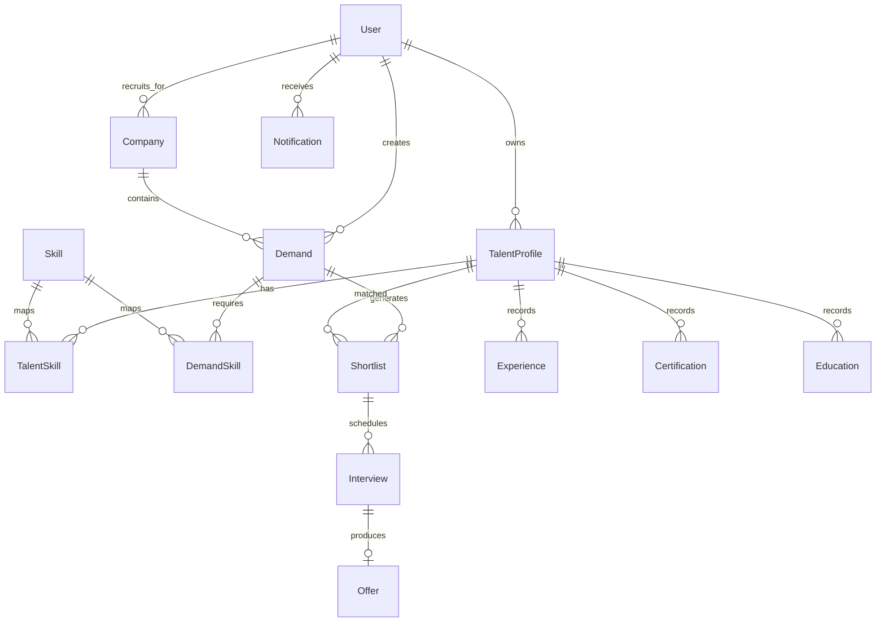

# Database Schema Guide

The platform uses PostgreSQL 16 with pgvector through Prisma.

## ERD overview



## Core entities

### User
- Authentication anchor for all roles.
- Roles: `TALENT`, `RECRUITER`, `ADMIN`, `HEADHUNTER`.
- Activation and verification controls support governance workflows.

### TalentProfile
- The main talent-side record used by matching, shortlisting, mobile profile management, and verification.
- Includes structured profile fields, resume metadata, verification state, identity document URLs, and pgvector embedding data.

### Skill and TalentSkill
- `Skill` is the canonical normalized catalog.
- `TalentSkill` attaches proficiency and years of experience to a profile.

### Demand and DemandSkill
- `Demand` represents a recruiter role request.
- `DemandSkill` stores structured required skills used by AI enhancement and shortlisting.

### Shortlist
- Join entity between a demand and a talent profile.
- Stores the composite match score, score breakdown JSON, AI explanation, recruiter-side status, and talent-side interest status.

### Interview
- Child of shortlist.
- Tracks schedule, recruiter feedback, operational status, and talent response status.

### Offer
- One-to-one with interview in the current workflow.
- Stores pay rate, dates, terms, and acceptance state.

### Notification
- Per-user event feed used by recruiter and talent workflows.
- Also powers mobile alert surfacing through Expo notifications.

## Prisma workflow

Generate client:

```bash
npm run db:generate --workspace @atm/db
```

Create a local migration during schema work:

```bash
npm run db:migrate --workspace @atm/db
```

Apply committed migrations to an existing database:

```bash
npx prisma migrate deploy --schema packages/db/prisma/schema.prisma
```

Seed demo data:

```bash
npm run db:seed --workspace @atm/db
```

## Recent schema additions

- `TalentProfile.identityDocumentUrls` for mobile verification uploads.
- `Interview.talentResponseStatus` for talent-side interview acceptance and decline handling.

## Demo data notes

The seed intentionally creates a believable story instead of synthetic junk:

- real role shapes across AI, full-stack, mobile, QA, data, cloud, and growth
- recruiter company seeds with different industries and company sizes
- talent seeds aligned to the matching and shortlisting scenarios used by the smoke workflow